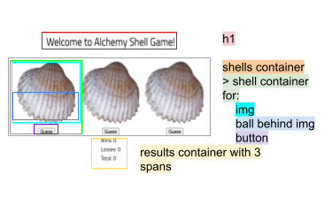

# Week 01: Shell Game

## Expected Layout

### HTML

`main`

-   `h1`

`> section.shells > .shell`:

-   `img#shell-1` + `.ball` + `button#button-1`

-   `img#shell-2` + `.ball` + `button#button-2`

-   `img#shell-3` + `.ball` + `button#button-3`

`^ section.stats`:

-   `divs` with `spans` for `#wins`, `#losses`, `#total`

### State

-   wins
-   total
-   losses (derived state - calculated from wins and total)

### Events

-   button clicks (user guess)
    -   increment total
    -   generate a random location for the ball (number between 1 and 3)
    -   take that location and add `.reveal` class to `img`
        -   If lines up with user guess, increment the wins
    -   remove `.reveal` on all shells to reset the game

## Current Workflow

-   Build HTML for shell section [complete]
-   Start style and get DOM elements for button1 and images [complete]
-   Start event listener for button1 with random location for ball [complete]
-   Add style to shell section elements [complete]
-   Create reset function [complete]
-   Build HTML for stats section [complete]
-   Get DOM elements for stats and initialize elements for state [complete]
-   Increment total and wins and display results for user [complete]
-   Get DOM elements and create event listener for button2 [complete]
-   Get DOM elements and create event listener for button3 [complete]

### Refactoring

-   Build `handleGuess()` function at end of code [complete]
-   Refactor buttons to be one eventListener
-   Update HTML with container `id` attributes

## Rubric Tasks and Point Values

### Code Quality / Grading Requirements

-   Open PR from dev to main with your changes 0.5
-   Preview deploy from Netlify showing on your PR 0.5
-   Clear commit history 1
-   Good naming conventions and code is easy to read 1
-   Effective use of CSS and semantic HTML 2

### Code Requirements

-   On clicking a hiding place button, the total number of guesses increment 2
-   On clicking the correct shell button, the total number of correct guesses increment 2
-   On clicking the incorrect shell button, the number of incorrect guesses increments 2
-   On click, see the ball revealed, clearing out the previous correct guess style 3
-   `displayResults` function for displaying the updated state 3
-   `reset` function for resetting the styles that display the correct location

## Attributions

Clker-Free-Vector-Images. [_Purple Seashell._](https://pixabay.com/vectors/seashell-clam-fan-purple-306124/). Pixabay.
